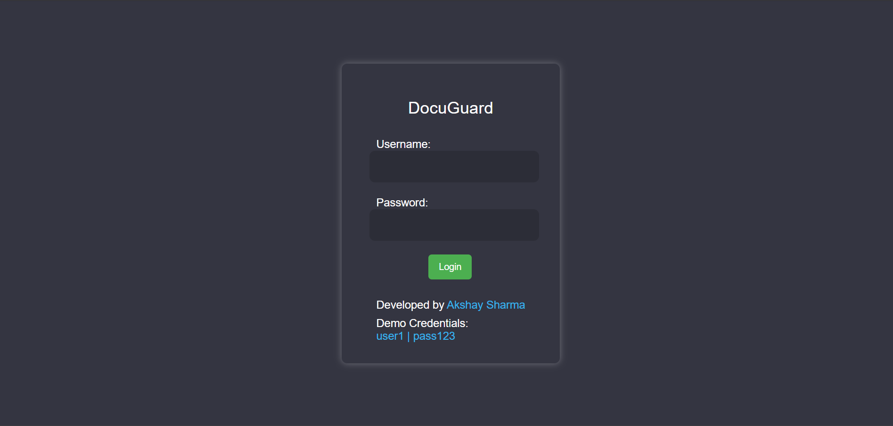
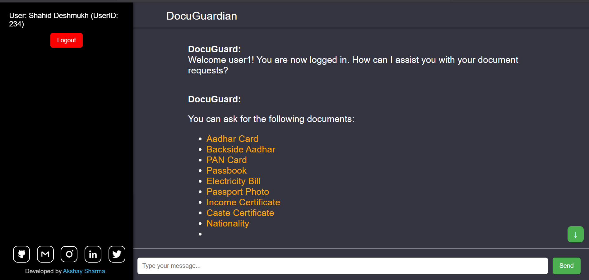

<div align="center">

<h1>🤖 DocuGuardian - ChatGPT-Inspired Document Storage & Retrieval</h1>

<p>A secure, conversational AI-powered document management system that lets users retrieve personal documents through natural language chat.</p>

[](https://chat-gpt-documents-storing.vercel.app/)
[](https://github.com/yahskamrahs/ChatGPT-Inspired-Documents-Storing)
[](https://chat-gpt-documents-storing.vercel.app/)

**Demo Credentials:** `user1` / `pass123`

</div>

---

## 📸 Screenshots

### Login Page
<div align="center">

</div>

### Chat Interface
<div align="center">

</div>

---

## 💡 Project Overview

**DocuGuardian** is a ChatGPT-inspired web application that revolutionizes personal document management. Instead of manually searching through folders, users can simply ask the AI chatbot for documents like "Show me my Aadhar Card" or "I need my PAN Card," and the system retrieves the requested document instantly.

### The Problem It Solves

Traditional document storage systems require users to:
- Remember exact file locations
- Navigate through multiple folders
- Use specific search terms
- Deal with complex file organization

**DocuGuardian** solves this by letting users retrieve documents through natural conversation, just like talking to ChatGPT.

---

## ✨ Key Features

### 🔐 Secure Authentication
- User login with username and password
- Session management
- Demo credentials for testing (`user1` / `pass123`)

### 💬 Conversational Document Retrieval
- ChatGPT-style chat interface
- Natural language document requests
- Instant document delivery
- User-friendly conversation flow

### 📄 Supported Document Types
The bot can retrieve the following documents:
- **Aadhar Card** (front)
- **Backside Aadhar** (back)
- **PAN Card**
- **Passbook**
- **Electricity Bill**
- **Passport Photo**
- **Income Certificate**
- **Caste Certificate**
- **Nationality Certificate**
- And more...

### 🎨 Clean UI/UX
- Dark mode interface
- Responsive design
- Smooth chat experience
- User information display
- Easy logout functionality

---

## 🛠️ Tech Stack

| Technology | Purpose |
|---|---|
| **HTML5** | Structure & semantic markup |
| **CSS3** | Styling, animations, and responsive design |
| **JavaScript (Vanilla)** | Core logic, chat functionality, authentication |
| **Local Storage** | User session management & document storage |
| **Vercel** | Hosting & deployment |

---

## 🚀 Getting Started

### Prerequisites

- A modern web browser (Chrome, Firefox, Safari, Edge)
- Basic understanding of HTML/CSS/JS (for customization)

### Installation & Local Setup

```bash
# 1. Clone the repository
git clone https://github.com/yahskamrahs/ChatGPT-Inspired-Documents-Storing.git

# 2. Navigate to the project folder
cd ChatGPT-Inspired-Documents-Storing

# 3. Open the project
# Option A: Double-click index.html
# Option B: Use a local server (recommended)
npx serve .
# or
python -m http.server 8000

# 4. Visit the app
# Open http://localhost:8000 in your browser
```

---

## 📖 How to Use

### Step 1: Login
1. Visit the live demo or run locally
2. Enter credentials:
   - **Username:** `user1`
   - **Password:** `pass123`
3. Click **Login**

### Step 2: Request Documents
Once logged in, you'll see the chat interface with DocuGuard bot. Simply type natural language requests:

**Example Queries:**
- "Show me my Aadhar Card"
- "I need my PAN Card"
- "Can you give me my Passport Photo?"
- "Show my Electricity Bill"

### Step 3: Receive Documents
The bot will:
1. Understand your request
2. Retrieve the document from storage
3. Display it in the chat
4. Provide a download option (if implemented)

---

## 📁 Project Structure

```
ChatGPT-Inspired-Documents-Storing/
├── index.html              # Main login page
├── chat.html               # Chat interface
├── styles/
│   ├── login.css           # Login page styles
│   └── chat.css            # Chat interface styles
├── scripts/
│   ├── auth.js             # Authentication logic
│   └── chatbot.js          # Chatbot & document retrieval
├── documents/              # Stored user documents
│   ├── user1/
│   │   ├── aadhar.pdf
│   │   ├── pan.pdf
│   │   └── ...
│   └── user2/
├── assets/
│   └── icons/              # UI icons
└── README.md               # You are here
```

---

## 🔒 Security Features

- **Client-side authentication** (demo mode)
- **Session management** using localStorage
- **User-specific document access**
- **Logout functionality** to end sessions

> ⚠️ **Note:** This is a demo project. For production use, implement:
> - Server-side authentication (JWT, OAuth)
> - Encrypted document storage
> - Database integration (MongoDB, PostgreSQL)
> - HTTPS/SSL
> - Role-based access control (RBAC)

---

## 🎯 Use Cases

- **Personal Document Management** - Store and retrieve important personal documents
- **Family Document Hub** - Centralized storage for family members
- **Educational Projects** - Learn about chatbot interfaces and document systems
- **Prototyping** - Base for building production-ready document management systems

---

## 🚧 Future Enhancements

- [ ] Backend integration with Node.js/Express
- [ ] Database storage (MongoDB/PostgreSQL)
- [ ] JWT-based authentication
- [ ] Document upload functionality
- [ ] Multi-user support
- [ ] Document categorization & tagging
- [ ] Search history
- [ ] Document versioning
- [ ] OCR for scanned documents
- [ ] Mobile app (React Native/Flutter)
- [ ] Voice-based document retrieval
- [ ] Multi-language support

---

## 🤝 Contributing

Contributions are welcome! Here's how you can help:

```bash
# 1. Fork the repository
# 2. Create a feature branch
git checkout -b feature/amazing-feature

# 3. Commit your changes
git commit -m "Add: amazing new feature"

# 4. Push to your branch
git push origin feature/amazing-feature

# 5. Open a Pull Request
```

**Areas for Contribution:**
- Backend development
- Security improvements
- UI/UX enhancements
- Additional document types
- Bug fixes
- Documentation

---

## 📝 Customization Guide

### Adding New Document Types

1. Update the document list in `chatbot.js`:
```javascript
const documentTypes = [
  { name: 'Aadhar Card', keywords: ['aadhar', 'aadhaar', 'uid'] },
  { name: 'PAN Card', keywords: ['pan', 'pan card'] },
  // Add your new document type here
  { name: 'Your Document', keywords: ['keyword1', 'keyword2'] }
];
```

2. Add the corresponding document file in `/documents/user1/`

### Changing UI Colors

Edit the CSS variables in your stylesheet:
```css
:root {
  --primary-color: #4f46e5;
  --bg-dark: #1a1a1a;
  --text-light: #ffffff;
}
```

---

## 📄 License

This project is open source and available under the [MIT License](LICENSE).

---

## 👤 Author

**Akshay Sharma**

- 🌐 Portfolio: [yahska-amrahs.vercel.app](https://yahska-amrahs.vercel.app/)
- 💼 LinkedIn: Connect on LinkedIn
- 🐙 GitHub: [@yahskamrahs](https://github.com/yahskamrahs)
- 🌐 Personal Website: [yahskamrahs.github.io](https://yahskamrahs.github.io/personal/)

---

## 🙏 Acknowledgments

- Inspired by ChatGPT's conversational interface
- Built for learning and demonstrating modern web development
- Special thanks to the open-source community

---

## 🌐 Live Demo

Try it now → **[https://chat-gpt-documents-storing.vercel.app/](https://chat-gpt-documents-storing.vercel.app/)**

**Demo Credentials:**
- Username: `user1`
- Password: `pass123`

---

<div align="center">

Made with ❤️ by Akshay Sharma | Deployed on Vercel

⭐ **Star this repo if you found it useful!**

</div>
